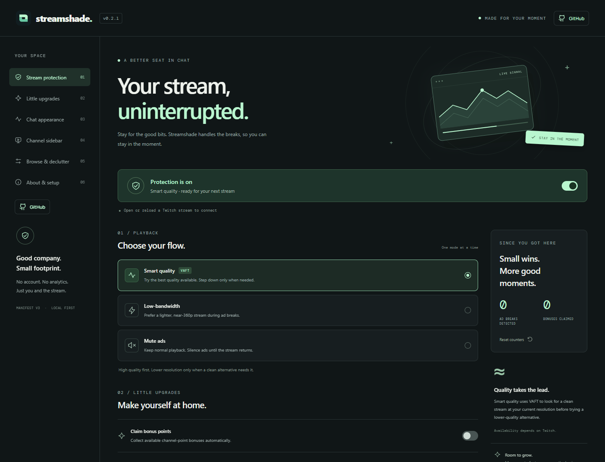
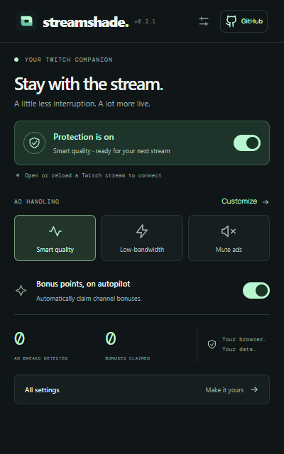
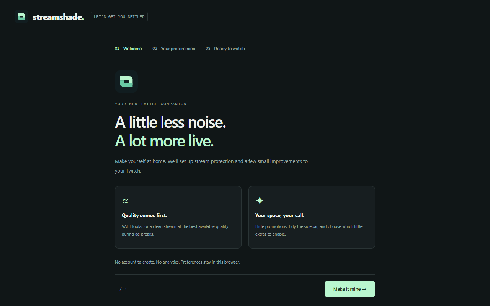
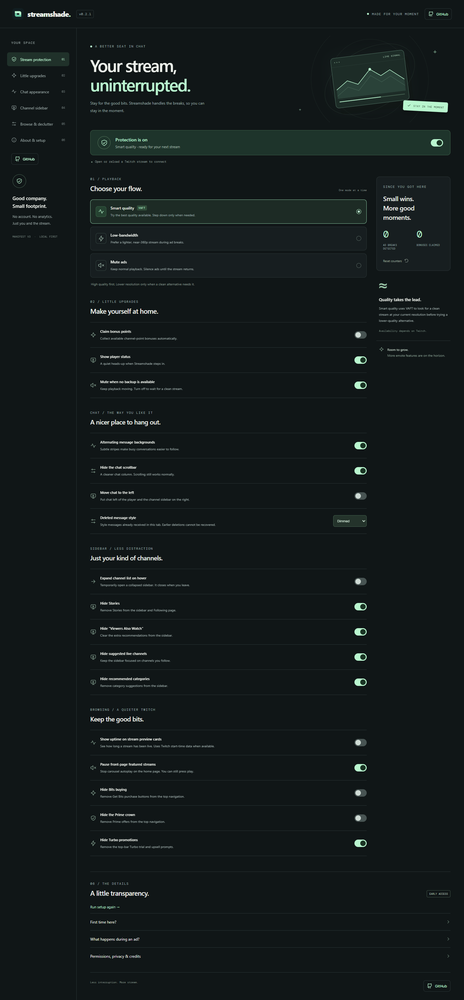
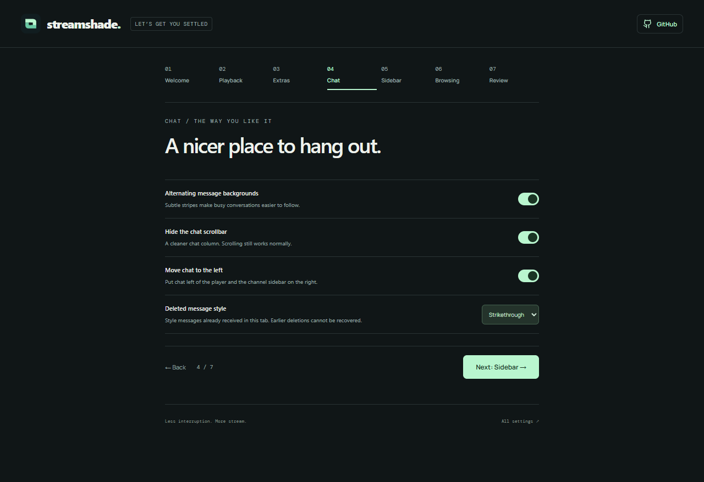

<div align="center">


# streamshade.

### A little less noise. A lot more live.

A thoughtfully designed Twitch companion for Chrome.<br>
Alternative streams during ads, a calmer interface, and the little extras that make it yours.

[](https://github.com/camwooloo/streamshade/releases/latest)

[](LICENSE)


**[Download the extension](https://github.com/camwooloo/streamshade/releases/latest)** · **[Install guide](#install-in-chrome)** · **[Report an issue](https://github.com/camwooloo/streamshade/issues)**



</div>

> **Early access · v0.2.1** — Ready to load unpacked. Chrome Web Store installation is not available yet. Clean replacement streams depend on Twitch; higher resolution and ad-free playback are not guaranteed.

## Stay with the stream

Streamshade adapts the locally bundled **VAFT** engine from [TwitchAdSolutions](https://github.com/pixeltris/TwitchAdSolutions) for Manifest V3. Choose how it handles an ad break, then fine-tune the rest of Twitch from one place.

| Playback mode | What it does |
| :--- | :--- |
| **Smart quality** · default | Tries clean streams at your current resolution before stepping down. Uses embed, popout, then autoplay alternatives. |
| **Low-bandwidth** | Prefers an autoplay alternative near 360p during the break. Your normal quality returns afterwards. |
| **Mute ads** | Leaves normal ad playback in place and temporarily silences the video. |

When no clean backup is available, the default fallback mutes the ad. You can turn that fallback off to wait for a clean stream instead; playback may pause. There is no external proxy and no blocker script downloaded at runtime.

## Your Twitch, a little tidier

| Area | Included controls |
| :--- | :--- |
| **Everyday extras** | Automatically claim available channel-point bonuses; show a small player-status notice. |
| **Chat** | Alternating message backgrounds, hidden scrollbar, chat on the left, and deleted-message styles. |
| **Channel sidebar** | Hover to expand; hide Stories, Viewers Also Watch, suggested live channels, and recommended categories individually. |
| **Less promotion** | Hide Bits buying, the Prime crown, and Turbo promotions, including **Try 1-Month Ad-Free**. |
| **Browsing** | Stream-preview uptime and an option to pause featured front-page autoplay. |
| **First-run setup** | Seven steps covering every playback, extras, chat, sidebar, and browsing preference, with a review before saving. |

Bonus claiming only clicks the available bonus button; it never spends points or redeems rewards. Deleted-message styles can retain text received while enabled in the current tab, but cannot recover messages deleted before they arrived. 7TV emote rendering is not included.

## A quick switch. A space of your own.

<table>
<tr>
<td width="34%" valign="top">
<h3>Quick controls</h3>
<p>Change modes, toggle protection, and reach all settings from the toolbar.</p>

</td>
<td width="66%" valign="top">
<h3>A warm welcome</h3>
<p>Choose your preferences on first install. Run setup again whenever you like.</p>

</td>
</tr>
</table>

<details>
<summary><strong>See the complete settings page</strong></summary>
<br>

</details>

<details>
<summary><strong>See chat preferences during onboarding</strong></summary>
<br>

</details>

Screenshots show the actual extension interface using test data, with no personal account information.

## Install in Chrome

**No build tools required.** Download the packaged release and load it once.

1. **[Download the latest release](https://github.com/camwooloo/streamshade/releases/latest).** Under **Assets**, choose `streamshade-0.2.1.zip`, not the automatic “Source code” download.
2. **Extract the ZIP** into a permanent folder, such as `Documents/Streamshade`.
3. Enter **`chrome://extensions`** in Chrome's address bar.
4. Enable **Developer mode** in the top-right corner.
5. Click **Load unpacked** and select the extracted folder that contains **`manifest.json`**.
6. Complete the welcome flow and **pin Streamshade** from Chrome's extensions menu.
7. Disable your previous **Twitch-specific** uBlock script or other Twitch ad blocker, then **reload Twitch**. General uBlock filtering can stay enabled.

Keep the extracted folder in place. Chrome remembers your installation across restarts. New installs default to Smart quality and hiding Turbo promotions; bonus claiming is opt-in.

**Already installed?** Replace the files inside the same extension folder, click Streamshade's reload button at `chrome://extensions`, and reload Twitch. Existing preferences are preserved. Unpacked builds do not update automatically from GitHub.

**Need setup again?** Open **All settings → About & setup → Run setup again**.

[Detailed installation and troubleshooting →](INSTALL.md)

## Private by design

[Read the privacy policy →](store/PRIVACY.md)

- **One extension API permission:** `storage`. Content scripts run on `www.twitch.tv`, `player.twitch.tv`, and `m.twitch.tv`.
- **Local preferences:** settings, setup completion, and aggregate counters stay in your browser.
- **No analytics, account, or external proxy.** Fonts, icons, and blocker logic are bundled.
- **Twitch requests stay with Twitch:** playback URLs, tokens, and existing session headers are processed in page/worker memory for playback. Optional uptime uses Twitch data and bounded Twitch API lookups.
- **No persistent chat or channel history.** Deleted-message text is held only in a bounded in-memory cache in the active tab.

The counters report detected ad breaks and observed bonus-button claims. They do not prove that every ad was blocked or measure the number of points awarded.

## What to expect

Twitch changes its player and interface regularly. Replacement streams can be unavailable, ads can get through, and playback can buffer. The current integration uses classic blob player workers; other worker shapes and new Twitch internals may need updates. Some sidebar label fallbacks currently recognize English only.

The automated suite covers playback fixtures, mode selection, settings, onboarding, and appearance controls. A live Twitch smoke check confirmed ordinary playback and several UI features. **A real ad break has not yet been verified in the live smoke test.** See the [validation notes](VALIDATION.md) for the exact scope.

A Chrome Web Store release is a separate step and requires review. The [publishing guide](store/PUBLISHING.md) explains the process; MV3 compatibility alone does not guarantee approval.

## Build & contribute

Use **Node.js 22 or newer**:

```sh
git clone https://github.com/camwooloo/streamshade.git
cd streamshade
npm ci
npm run build
npm test
```

Load **`dist/streamshade`** through Chrome's **Load unpacked** button.

```sh
# Browser integration tests
npx playwright install chromium
npm run test:browser

# Standalone interface preview
npm run preview
```

The preview runs at `http://127.0.0.1:4173` with separate preview preferences and no Twitch effects. On Windows, tests can use installed Edge by setting `STREAMSHADE_BROWSER` to its executable path.

| Path | Purpose |
| :--- | :--- |
| `extension/` | Manifest, playback integration, content features, and interface |
| `reference/vaft.js` | Pinned upstream VAFT source |
| `scripts/adapt-vaft.mjs` | Explicit, checked transformations for the MV3 integration |
| `tests/` | Unit tests and browser fixtures |
| `store/` | Chrome Web Store publishing guide and draft submission materials |

Found a problem? [Open an issue](https://github.com/camwooloo/streamshade/issues) with your browser and extension versions, mode, and steps to reproduce. Please remove private chat details, cookies, and tokens from logs or screenshots.

## Credits & license

Streamshade is [MIT licensed](LICENSE). Its playback engine adapts VAFT v24 from [pixeltris/TwitchAdSolutions](https://github.com/pixeltris/TwitchAdSolutions), with the upstream MIT license preserved. Manrope and DM Mono are bundled under the SIL Open Font License. See [third-party notices](THIRD_PARTY_NOTICES.md) for provenance and modifications.

Independent project. Not affiliated with or endorsed by Twitch, 7TV, or TwitchAdSolutions contributors.

<div align="center">
<br>
<sub>Less interruption. More stream.</sub>
</div>
